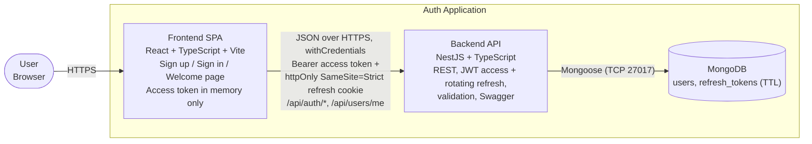

# C2 – Container Diagram

```mermaid
flowchart LR
    user([User<br/>Browser])

    subgraph system[Auth Application]
        spa["Frontend SPA<br/>React + TypeScript + Vite<br/>Sign up / Sign in / Welcome page<br/>Access token in memory only"]
        api["Backend API<br/>NestJS + TypeScript<br/>REST, JWT access + rotating refresh,<br/>validation, Swagger"]
        db[("MongoDB<br/>users, refresh_tokens (TTL)")]
    end

    user -- "HTTPS" --> spa
    spa -- "JSON over HTTPS, withCredentials<br/>Bearer access token +<br/>httpOnly SameSite=Strict refresh cookie<br/>/api/auth/*, /api/users/me" --> api
    api -- "Mongoose (TCP 27017)" --> db
```

