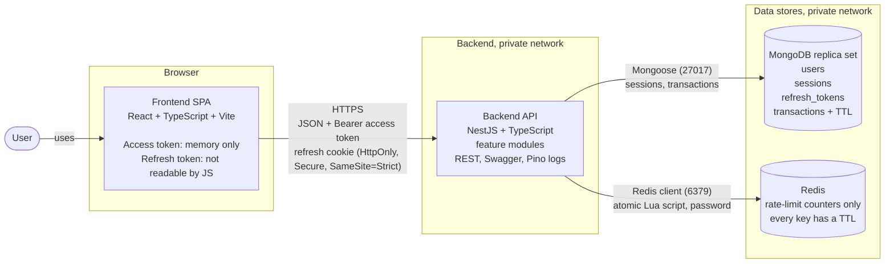
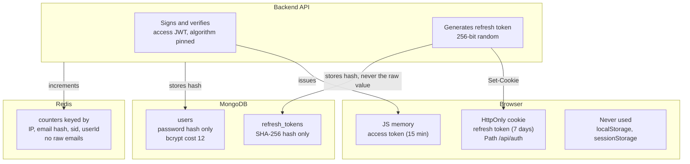
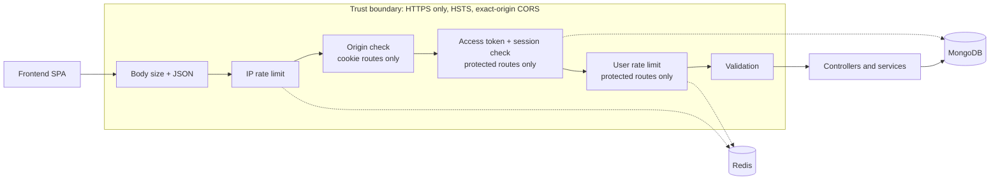
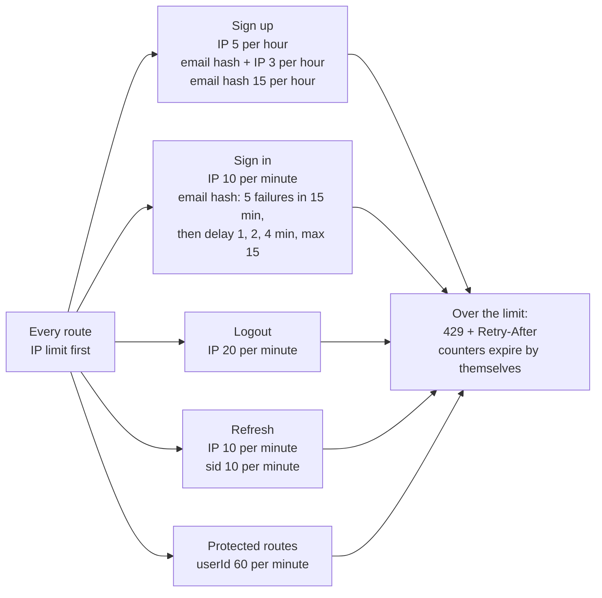
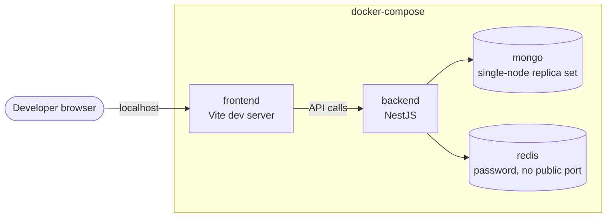

# C2 – Container Diagram

## 1. Containers

```mermaid
flowchart LR
    user([User])

    subgraph browser[Browser]
        spa["Frontend SPA<br/>React + TypeScript + Vite<br/><br/>Access token: memory only<br/>Refresh token: not readable by JS"]
    end

    subgraph backend[Backend, private network]
        api["Backend API<br/>NestJS + TypeScript<br/>feature modules<br/>REST, Swagger, Pino logs"]
    end

    subgraph data[Data stores, private network]
        mongo[("MongoDB replica set<br/>users<br/>sessions<br/>refresh_tokens<br/>transactions + TTL")]
        redis[("Redis<br/>rate-limit counters only<br/>every key has a TTL")]
    end

    user -- "uses" --> spa
    spa -- "HTTPS<br/>JSON + Bearer access token<br/>refresh cookie (HttpOnly, Secure, SameSite=Strict)" --> api
    api -- "Mongoose (27017)<br/>sessions, transactions" --> mongo
    api -- "Redis client (6379)<br/>atomic Lua script, password" --> redis
```

## 2. Where each secret lives

```mermaid
flowchart TB
    subgraph browser[Browser]
        mem["JS memory<br/>access token (15 min)"]
        cookie["HttpOnly cookie<br/>refresh token (7 days)<br/>Path /api/auth"]
        nostore["Never used<br/>localStorage, sessionStorage"]
    end
    subgraph api[Backend API]
        jwt["Signs and verifies<br/>access JWT, algorithm pinned"]
        gen["Generates refresh token<br/>256-bit random"]
    end
    subgraph mongo[MongoDB]
        hash["refresh_tokens<br/>SHA-256 hash only"]
        pw["users<br/>password hash only<br/>bcrypt cost 12"]
    end
    subgraph redis[Redis]
        cnt["counters keyed by<br/>IP, email hash, sid, userId<br/>no raw emails"]
    end

    jwt -- "issues" --> mem
    gen -- "Set-Cookie" --> cookie
    gen -- "stores hash, never the raw value" --> hash
    api -- "stores hash" --> pw
    api -- "increments" --> cnt
```

## 3. Request path and trust boundary

```mermaid
flowchart LR
    spa["Frontend SPA"]
    subgraph edge[Trust boundary: HTTPS only, HSTS, exact-origin CORS]
        direction LR
        c1["Body size + JSON"]
        c2["IP rate limit"]
        c3["Origin check<br/>cookie routes only"]
        c4["Access token + session check<br/>protected routes only"]
        c5["User rate limit<br/>protected routes only"]
        c6["Validation"]
        c1 --> c2 --> c3 --> c4 --> c5 --> c6
    end
    app["Controllers and services"]
    mongo[("MongoDB")]
    redis[("Redis")]

    spa --> c1
    c6 --> app --> mongo
    c2 -.-> redis
    c5 -.-> redis
    c4 -.-> mongo
```

## 4. Rate limits

```mermaid
flowchart LR
    ip["Every route<br/>IP limit first"]

    ip --> su["Sign up<br/>IP 5 per hour<br/>email hash + IP 3 per hour<br/>email hash 15 per hour"]
    ip --> si["Sign in<br/>IP 10 per minute<br/>email hash: 5 failures in 15 min,<br/>then delay 1, 2, 4 min, max 15"]
    ip --> lo["Logout<br/>IP 20 per minute"]
    ip --> rf["Refresh<br/>IP 10 per minute<br/>sid 10 per minute"]
    ip --> pr["Protected routes<br/>userId 60 per minute"]

    su & si & lo & rf & pr --> res["Over the limit:<br/>429 + Retry-After<br/>counters expire by themselves"]
```

## 5. Failure behavior

```mermaid
flowchart TB
    api["Backend API"]

    api -- "Redis down" --> r{"Which route?"}
    r -- "sign up, sign in,<br/>logout, refresh" --> closed["Fail closed<br/>503 + Retry-After<br/>critical log"]
    r -- "per-user limit on<br/>protected routes" --> open["Fail open<br/>critical log<br/>session still checked in MongoDB"]

    api -- "MongoDB down" --> m["503<br/>no tokens issued<br/>session check fails closed"]
    api -- "restart" --> s["Redis counters survive<br/>sessions and tokens live in MongoDB"]
```

## 6. Local deployment

```mermaid
flowchart LR
    dev([Developer browser])
    subgraph compose[docker-compose]
        fe["frontend<br/>Vite dev server"]
        be["backend<br/>NestJS"]
        mg[("mongo<br/>single-node replica set")]
        rd[("redis<br/>password, no public port")]
    end

    dev -- "localhost" --> fe
    fe -- "API calls" --> be
    be --> mg
    be --> rd
```
