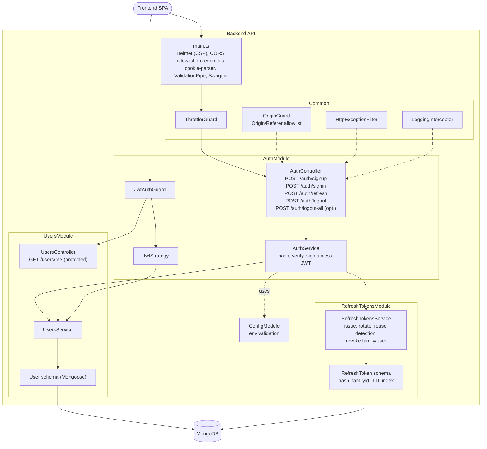
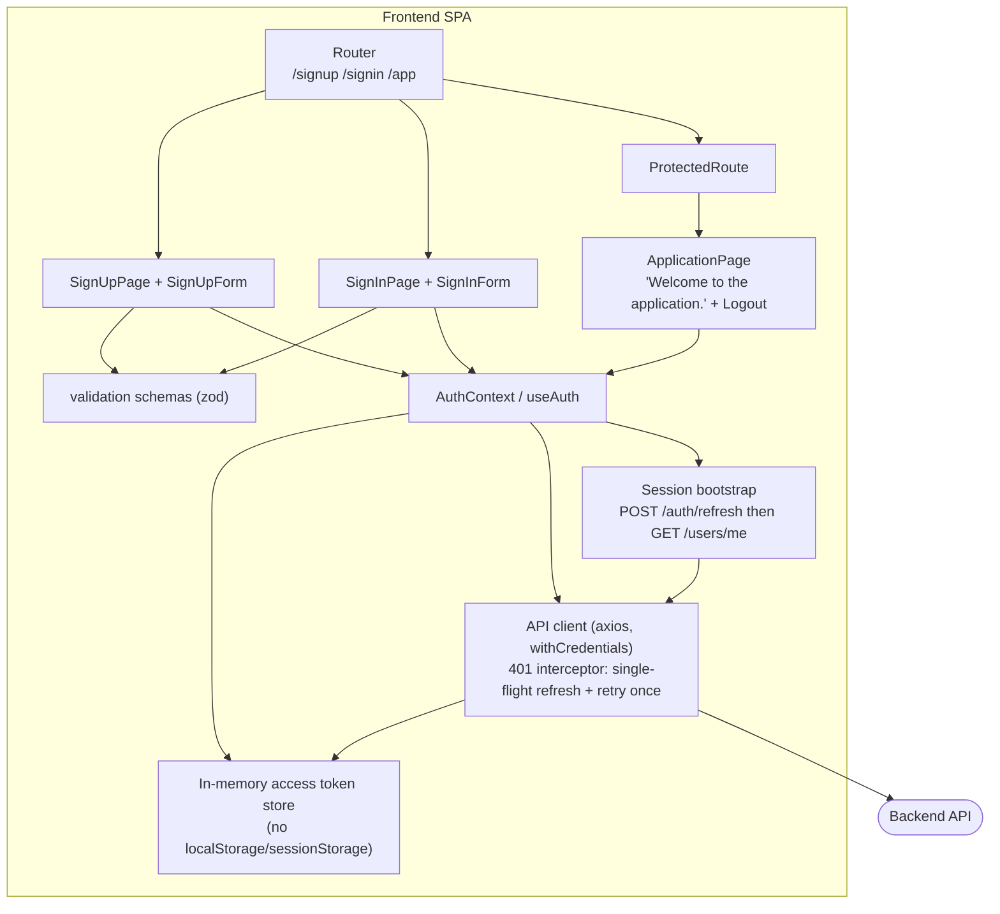

# C3 – Component Diagram

## Backend API (NestJS)

```mermaid
flowchart TB
    client([Frontend SPA])

    subgraph api[Backend API]
        direction TB
        main["main.ts<br/>Helmet (CSP), CORS allowlist + credentials,<br/>cookie-parser, ValidationPipe, Swagger"]
        subgraph common[Common]
            filter["HttpExceptionFilter"]
            logger["LoggingInterceptor"]
            throttle["ThrottlerGuard"]
            og["OriginGuard<br/>Origin/Referer allowlist"]
        end
        subgraph auth[AuthModule]
            ac["AuthController<br/>POST /auth/signup<br/>POST /auth/signin<br/>POST /auth/refresh<br/>POST /auth/logout<br/>POST /auth/logout-all (opt.)"]
            as["AuthService<br/>hash, verify, sign access JWT"]
            js["JwtStrategy"]
            jg["JwtAuthGuard"]
        end
        subgraph rt[RefreshTokensModule]
            rs["RefreshTokensService<br/>issue, rotate, reuse detection,<br/>revoke family/user"]
            rr["RefreshToken schema<br/>hash, familyId, TTL index"]
        end
        subgraph users[UsersModule]
            uc["UsersController<br/>GET /users/me (protected)"]
            us["UsersService"]
            ur["User schema (Mongoose)"]
        end
        cfg["ConfigModule<br/>env validation"]
    end
    db[("MongoDB")]

    client --> main --> throttle --> ac
    client --> jg --> uc
    ac --> as --> us --> ur --> db
    og -.-> ac
    as --> rs --> rr --> db
    uc --> us
    jg --> js
    js --> us
    as -. "uses" .-> cfg
    filter -.-> ac
    logger -.-> ac
```

## Frontend SPA (React)

```mermaid
flowchart TB
    subgraph spa[Frontend SPA]
        router["Router<br/>/signup /signin /app"]
        pr["ProtectedRoute"]
        su["SignUpPage + SignUpForm"]
        si["SignInPage + SignInForm"]
        app["ApplicationPage<br/>'Welcome to the application.' + Logout"]
        val["validation schemas (zod)"]
        ctx["AuthContext / useAuth"]
        http["API client (axios, withCredentials)<br/>401 interceptor: single-flight refresh + retry once"]
        store["In-memory access token store<br/>(no localStorage/sessionStorage)"]
        boot["Session bootstrap<br/>POST /auth/refresh then GET /users/me"]
    end
    api([Backend API])

    router --> su & si
    router --> pr --> app
    su & si --> val
    su & si --> ctx --> http --> api
    ctx --> store
    http --> store
    ctx --> boot --> http
    app --> ctx
```
