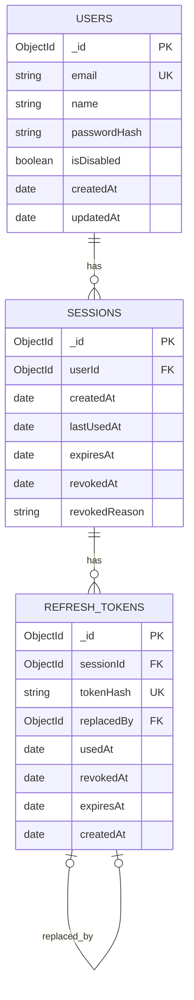

# Database Design (ERD)

```mermaid
erDiagram
    USERS ||--o{ SESSIONS : "has"
    SESSIONS ||--o{ REFRESH_TOKENS : "has"
    REFRESH_TOKENS |o--o| REFRESH_TOKENS : "replaced_by"

    USERS {
        ObjectId _id PK
        string email UK
        string name
        string passwordHash
        boolean isDisabled
        date createdAt
        date updatedAt
    }

    SESSIONS {
        ObjectId _id PK
        ObjectId userId FK
        date createdAt
        date lastUsedAt
        date expiresAt
        date revokedAt
        string revokedReason
    }

    REFRESH_TOKENS {
        ObjectId _id PK
        ObjectId sessionId FK
        string tokenHash UK
        ObjectId replacedBy FK
        date usedAt
        date revokedAt
        date expiresAt
        date createdAt
    }
```