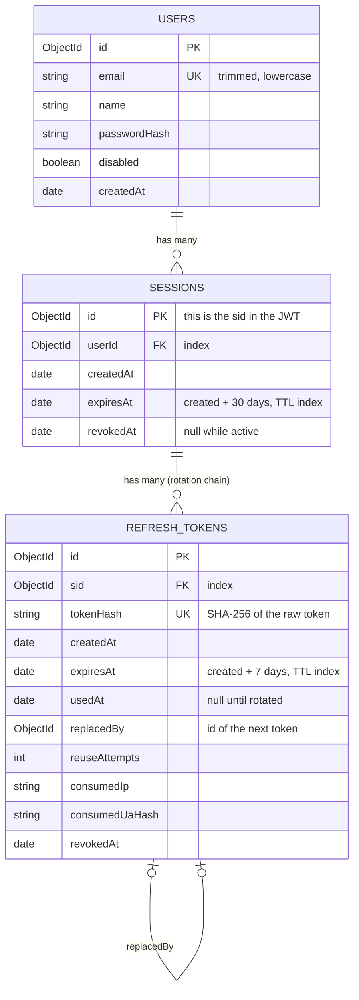

# Database Design (MongoDB + Mongoose)

```mermaid
erDiagram
    USERS ||--o{ SESSIONS : "has many"
    SESSIONS ||--o{ REFRESH_TOKENS : "has many (rotation chain)"
    REFRESH_TOKENS |o--o| REFRESH_TOKENS : "replacedBy"

    USERS {
        ObjectId id PK
        string email UK "trimmed, lowercase"
        string name
        string passwordHash
        boolean disabled
        date createdAt
    }
    SESSIONS {
        ObjectId id PK "this is the sid in the JWT"
        ObjectId userId FK "index"
        date createdAt
        date expiresAt "created + 30 days, TTL index"
        date revokedAt "null while active"
    }
    REFRESH_TOKENS {
        ObjectId id PK
        ObjectId sid FK "index"
        string tokenHash UK "SHA-256 of the raw token"
        date createdAt
        date expiresAt "created + 7 days, TTL index"
        date usedAt "null until rotated"
        ObjectId replacedBy "id of the next token"
        int reuseAttempts
        string consumedIp
        string consumedUaHash
        date revokedAt
    }
```
